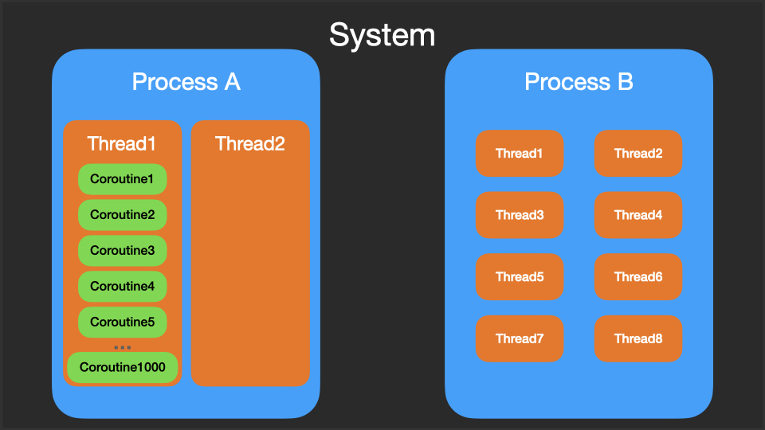
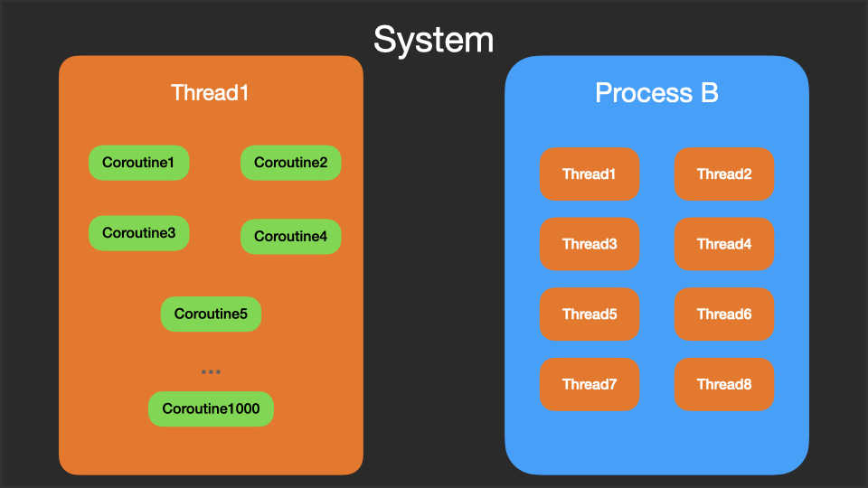
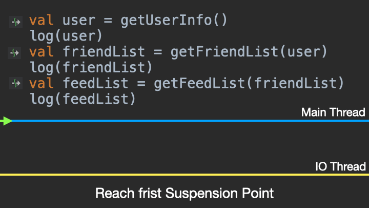
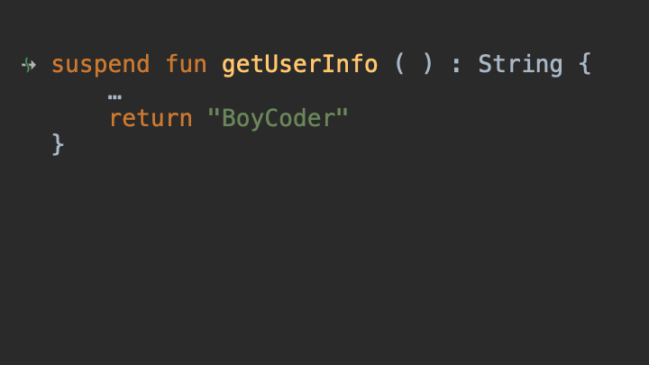
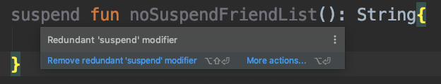
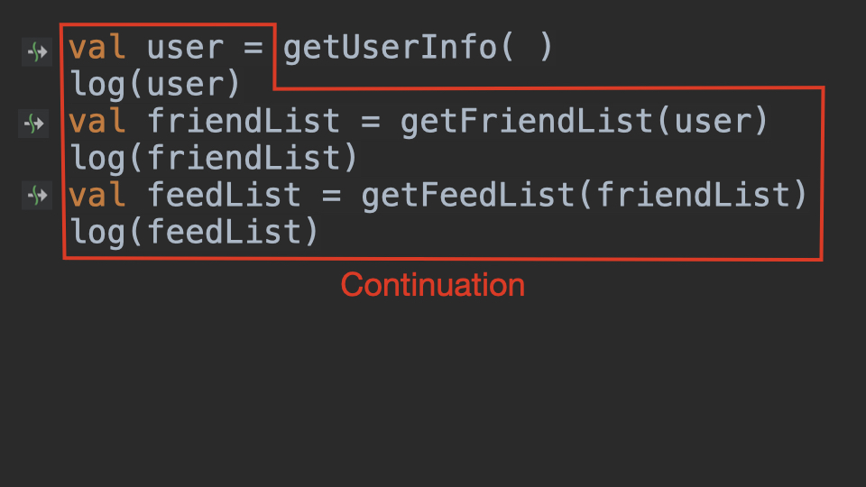
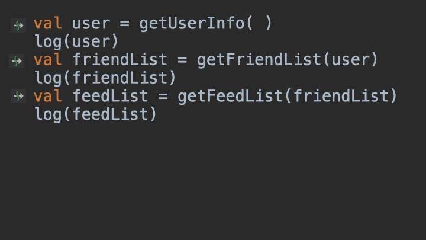

# Diagram Coroutines: suspend

## 1. Preface

Coroutines is the most amazing thing in Kotlin.

In this post, I will briefly introduce Kotlin coroutines, and then explain "Coroutines Under The Hood" in the form of `Diagram + Animation`. After reading this post, you may find out that Coroutines is not that difficult.

## 2. Preparation

- Keep your Android Studio updated.
- Clone our demo, and open it in Android Studio: [https://github.com/chaxiu/KotlinJetpackInAction](https://github.com/chaxiu/KotlinJetpackInAction)
- Checkout the branch: `chapter_09_Coroutines_suspend.`
- **Run and debug** while you're reading.

## 3. Thread & Coroutines

Some differences between them:

### Thread

- Thread is an operating-system-level concept.
- Thread in Java is "user thread", but it is mapped to "kernel thread" under the hood.(Non Green Thread)
- Operating system is responsible for the switching and scheduling between threads
- Threads are preemptive, memory resources can be shared between them, processes don't.
- Thread sharing resources causes `Thread Synchronization Problem`
- [Green Threads](https://en.wikipedia.org/wiki/Green_threads) in Java 1.1, is "user-level threads". They are scheduled by user-level process, not by the kernel.

Some people compare threads to **lightweight processes**.
 
### Coroutines

- Kotlin Coroutines kind like "Green Threads" above. Thousands of Coroutines can run on only one thread.
- Kotlin Coroutines is **not** operating-system-level concept.
- Kotlin Coroutines is user-level concept, kernel know nothing about Coroutines.
- Kotlin Coroutines are not preemptive, so it's more **efficient**.
- Kotlin Coroutines use state machine under the hood, several Coroutines can share the same instance of state machine, so it is **lightweight**
 
Some people compare Coroutines to **lightweight threads**.

Thousands of Coroutines can run on only one thread.



From the perspective of the containment relationship, **the relationship between coroutines and thread** is a bit like the "relationship between the thread and the process". 

Coroutines cannot run without threads.



Although the Coroutines cannot run without a thread, it can switch between different threads.


Knowing coroutines is efficient and lightweight, but are we going to use it based on its "efficient" and "lightweight"? Assembly is also very efficient. C can also be lightweight.

Efficient and lightweight are not the core competitiveness of Kotlin Coroutines.

The killing feature of Kotlin Coroutines is: it can **simplify** asynchronous concurrency programming —— `writing asynchronous program in sequential way`.

We all know how dangerous `threads concurrency` is, and how difficult to maintain the code.

## 3. Asynchronous & Callback Hell

Taking a asynchronous Java code as an example, we send an request to query the user's information using CallBack:

```java
getUserInfo(new CallBack() {
    @Override
    public void onSuccess(String response) {
        if (response != null) {
            System.out.println(response);
        }
    }
});
```

So far so good. What if our business logic becomes like this?
 
Query user info --> Query friend list of that user --> Query feed list of his friends?

Code may like this:

```java
getUserInfo(new CallBack() {
    @Override
    public void onSuccess(String user) {
        if (user != null) {
            System.out.println(user);
            getFriendList(user, new CallBack() {
                @Override
                public void onSuccess(String friendList) {
                    if (friendList != null) {
                        System.out.println(friendList);
                        getFeedList(friendList, new CallBack() {
                            @Override
                            public void onSuccess(String feed) {
                                if (feed != null) {
                                    System.out.println(feed);
                                }
                            }
                        });
                    }
                }
            });
        }
    }
});
```

Crazy, right? 

This is only the case of **onSuccess**, in the real world situation, that could be more complicated: exceptions, retries, thread scheduling, synchronization...

## 4. Hell to heaven: Coroutines
 
We are talking about Coroutines, so what does it looks like if we re-write the code using Kotlin Coroutines?

```kotlin
val user = getUserInfo()
val friendList = getFriendList(user)
val feedList = getFeedList(friendList)
```

Extremely simple three lines of code, right?

This is why we love Kotlin Coroutines: `writing asynchronous program in sequential way`.

### 4-1 How to use Coroutines

The reason why the code above can be written in a sequential way is  because of the definition of "the three requesting functions". They are not ordinary functions, they all have modifier: `suspend`, which means that they are all: `Suspending Functions`.

```kotlin
// delay(1000L) representing request to server

//Suspending Function
// ↓
suspend fun getUserInfo(): String {
    withContext(Dispatchers.IO) {
        delay(1000L)
    }
    return "BoyCoder"
}
//Suspending Function
// ↓
suspend fun getFriendList(user: String): String {
    withContext(Dispatchers.IO) {
        delay(1000L)
    }
    return "Tom, Jack"
}
//Suspending Function
// ↓
suspend fun getFeedList(list: String): String {
    withContext(Dispatchers.IO) {
        delay(1000L)
    }
    return "{FeedList..}"
}
```

So, what a **Suspending Function** really is?

### 4-2 Suspending Function

A suspending function is simply a function that can be paused and resumed at a later time. 

Let's take a look at the execution flow of the suspending function, and notice the flashing in the animation, which means requesting server.



From the animation above, we can learn a lot of information:

- Thread switching is happening in the sequential code above.
- One line of code, switching between two threads.
- left side of `=`: Main Thread
- right side of `=`: IO Thread
- Every time from `Main thread` to, `Suspend` happened.
- Every time from `IO thread` to `Main thread`, `Resume` happened.
- Suspend and Resume are "unique ability" of suspending function, ordinary functions don't.
- Suspend, just means passing execution flow to other threads, the main thread is not blocked.
- If we run this code on Android, ANR won't happen.

Enough explanation, so how Kotlin Coroutines can `Switching Between Two Threads In One Line of Code`?

All the magic is hidden behind the `suspend` keyword in the Suspending Function.

## 5. Suspend under the hood

The essence of `suspend` is `CallBack`.

```kotlin
suspend fun getUserInfo(): String {
    withContext(Dispatchers.IO) {
        delay(1000L)
    }
    return "BoyCoder"
}
```

You may ask: Where is the "CallBack"? Yes, we didn't write anything about CallBack, but we wrote `suspend`. When Kotlin compiler detects the `suspend`, it will **automatically convert the suspend function into a function with CallBack**.

If we decompile the above suspend function into Java, the result will like this:

```java
//                          Continuation is nothing but CallBack
//                                         ↓         
public static final Object getUserInfo(Continuation $completion) {
  ...
  return "BoyCoder";
}
```

Let's take a look at the definition of Continuation in Kotlin:

```kotlin
public interface Continuation<in T> {
    public val context: CoroutineContext
//   just like: onSuccess(result)
//                 ↓         ↓
    public fun resumeWith(result: Result<T>)
}
```

Let's take a look at `CallBack`:

```java
interface CallBack {
    void onSuccess(String response);
}
```

As we can see, Continuation is actually a CallBack with generic parameters, and with a `CoroutineContext`, which is the context of the Coroutines.

The process above from `Suspending Function` to `CallBack Function` is called: **Continuation-Passing-Style Transformation**.

See, that is the reason why Kotlin uses Continuation instead of CallBack, just a better name.

The following animation demonstrates the change of the Function Signature of the `Suspending Function` during the CPS Transformation:



This transformation looks simple, but there are some details hidden in there.

### Function Type

In the above CPS process, function type has changed: from `suspend ()->String` to `(Continuation)-> Any?`.

This means that if you call a Kotlin suspending function `getUserInfo()` in Java, the type of `getUserInfo()` in Java will be: `(Continuation)-> Object`. (Receive Continuation as a parameter, return value is Object)

In this CPS process, `suspend ()` becomes `(Continuation)` as we have explained before, but why does the `return type` of the function changed from: `String` to `Any?`

### Return Type of Suspending Function

After the suspend function is converted by CPS, its return value representing: `whether the Suspending Function is suspended or not`.

This sounds a bit confusing: a suspend function is a function that can be suspended and resume. Can it be non-suspended? Yes, the suspension of Suspending Function could happen, or not. It depends.

Let's take a look some examples：

This is a normal suspending function

```kotlin
suspend fun getUserInfo(): String {
    withContext(Dispatchers.IO) {
        delay(1000L)
    }
    return "BoyCoder"
}
```

When getUserInfo() executes to `withContext`, it will return `CoroutineSingletons.COROUTINE_SUSPENDED` indicating that the function is suspended.

Now the question is coming. Is the following function a suspend function:

```
// suspend modifier
// ↓
suspend fun noSuspendFriendList(user: String): String{
    // body is just like normal function
    return "Tom, Jack"
}
```

Answer: It is a suspend function. 

But it is different from the general Suspending Function: when it is executed, it will not be suspended because it is a normal function. 

So, if you write such code, the IDE will also warn you that `suspend modifier is redundant`:




When `noSuspendFriendList()` is called, it will not suspend, it will directly return String type: `"no suspend"`. Such a suspend function, you can think of it as a **fake suspend function**.

### The reason why return type is Any?

Because of the Suspending Function, it may return `CoroutineSingletons.COROUTINE_SUSPENDED`, may also return the actual result `"no suspend"`, or even return `null`. In order to adapt to all possibilities, the function return type after CPS transformation It can only be `Any?`.

### Summary

- Functions with `suspend` modifier is `Suspending Function`.
- Suspending Function, which may not always suspended during execution.
- The Suspending Function can only be called in other Suspending Function.
- When the Suspending Function contains other Suspending Functions, it will really be suspended.

The above is the details of the function signature changes during the CPS process.

However, this is not all of the CPS transformation, because we still don't know what Continuation is.

## 6. CPS transformation

The word `Continuation`, if you look up [Dictionary](https://dictionary.cambridge.org/zhs/%E8%AF%8D%E5%85%B8/%E8%8B%B1%E8%AF%AD/continuation ) or [Wikipedia](https://en.wikipedia.org/wiki/Continuation), you may be confused , so abstract.

It will be easier to understand Continuation through the examples in our article.

Continuation, simply explained, it's just `what to do next`.

Put it in the program, Continuation represents the code that needs to be executed when the program continues to run, `code to be executed next` or `remaining code`.

Take the above code as an example, when the program executes to `getUserInfo()`, its `Continuation` is the code in the red box below:


Continuation is `the code to be run next`, `the remaining unexecuted code`.

After understanding Continuation, `CPS` will be quite easy to understand, it is actually: `a transformation of passing the unexecuted code. `

And `CPS transformation` is the process of converting the original `sequential suspending code` into `CallBack asynchronous code`. This transformation is done by the compiler behind the scenes, and we programmers don't perceive it, unless we read the Bytecode.



Somebody may sneered: `So simple and "naive"? Will the three Suspending Functions eventually become three Callbacks? `

Of course not, it's still the idea of CPS, but much "smarter" than Callback.

Next, let's take a look at the decompiled code of the Suspending Functions. So much has been laid, all for the next part.

## 7. Bytecode decompilation

Decompilation of Bytecode into Java is easy to do with Android Studio. But, this time I will not post the decompiled code directly, because the logic of the decompiled code of Coroutines is messy and the readability is so bad. CPU may like this kind of code, but it is really not what human like.

So, in order to make it easier for everyone to understand, the code I posted next is the `roughly equivalent` code after I use Kotlin translation, which improves readability and omits unnecessary details. 

**I believe that if you can understand everything in this article, your understanding of coroutines will surpass most people.**

This is the code we are about to study, the code before `testCoroutine()` decompilation:

```kotlin
suspend fun testCoroutine() {
    log("start")
    val user = getUserInfo()
    log(user)
    val friendList = getFriendList(user)
    log(friendList)
    val feedList = getFeedList(friendList)
    log(feedList)
}
```

After decompilation, the signature of the `testCoroutine` function becomes like this:

```kotlin
fun testCoroutine(completion: Continuation<Any?>): Any? {}
```

The same for several other suspending functions:

```kotlin
fun getUserInfo(completion: Continuation<Any?>): Any?{}
fun getFriendList(user: String, completion: Continuation<Any?>): Any?{}
fun getFeedList(friendList: String, completion: Continuation<Any?>): Any?{}
```

Next, let's look at the `body` of `testCoroutine()` after decompilation, which is quite complicated and involves the calls of three suspending functions.

First of all, in the testCoroutine() function, there will be an additional subclass of ContinuationImpl, which is the core of the entire coroutine suspending function. The comments in the code are showing detail.
 


```kotlin
fun testCoroutine(completion: Continuation<Any?>): Any? {

    class TestContinuation(completion: Continuation<Any?>?) : ContinuationImpl(completion) {
        // Represents the current state of the coroutines state machine
        var label: Int = 0
        // Coroutines results
        var result: Any? = null

        // Used to save the calculation results of the previous coroutine
        var mUser: Any? = null
        var mFriendList: Any? = null

        // invokeSuspend is the key
        // It will eventually call testCoroutine(this)
        // to start the coroutine state machine
        // The state machine code is the when statement below
        // The essence of coroutine is CPS + state machine
        override fun invokeSuspend(_result: Result<Any?>): Any? {
            result = _result
            label = label or Int.Companion.MIN_VALUE
            // testCoroutine(this) could be called several times
            return testCoroutine(this)
        }
    }
}
```

The next step is to determine whether `testCoroutine()` is running for the first time. If it is running for the first time, it is necessary to create an instance of TestContinuation(subclass of ContinuationImpl).

```kotlin
//                    ↓
fun testCoroutine(completion: Continuation<Any?>): Any? {
    ...
    val continuation = if (completion is TestContinuation) {
        completion
    } else {
        //               As parameter
        //                   ↓
        TestContinuation(completion)
    }
}
```

- invokeSuspend() will eventually call testCoroutine() and will come to this If statement
- If it is the first run, a TestContinuation instance will be created with completion as a parameter
- This means wrapping the **old Continuation** as a **new Continuation**
- If it is not the first run, directly assign completion to continuation
- This means that continuation will only generate **one instance** during the entire life time, which can greatly save memory (compared to CallBack)

Next is the definition of several variables, there will be detailed comments in the code:

```kotlin
// Three variables, corresponding to the three variables of the original function
lateinit var user: String
lateinit var friendList: String
lateinit var feedList: String

// The running result of the coroutine
var result = continuation.result

// The return of the suspending function
var suspendReturn: Any? = null

// CoroutineSingletons Is an enum class
// COROUTINE_SUSPENDED means the current function is suspended
val sFlag = CoroutineSingletons.COROUTINE_SUSPENDED
```

Then we come to the **core** of our state machine. See the comments for details:

```kotlin
when (continuation.label) {
    0 -> {
        // check exceptions
        throwOnFailure(result)

        log("start")
        // Assign 1 to label, ready for the next state
        continuation.label = 1

        // Call getUserInfo()
        suspendReturn = getUserInfo(continuation)

        // Determine if it suspended
        if (suspendReturn == sFlag) {
            return suspendReturn
        } else {
            result = suspendReturn
            //go to next state
        }
    }

    1 -> {
        throwOnFailure(result)

        // Get user value from result
        user = result as String
        log(user)
        // Saving user value in continuation
        continuation.mUser = user
        // Ready for next state
        continuation.label = 2

        // Call getFriendList
        suspendReturn = getFriendList(user, continuation)

        // Determine if it suspended
        if (suspendReturn == sFlag) {
            return suspendReturn
        } else {
            result = suspendReturn
            //go to next state
        }
    }

    2 -> {
        throwOnFailure(result)

        user = continuation.mUser as String

        // Get friendList value from result
        friendList = result as String
        log(friendList)

        // Saving values in continuation
        continuation.mUser = user
        continuation.mFriendList = friendList

        // Ready for next state
        continuation.label = 3

        // Call getFeedList
        suspendReturn = getFeedList(friendList, continuation)

        // Determine if it suspended
        if (suspendReturn == sFlag) {
            return suspendReturn
        } else {
            result = suspendReturn
            //go to next state
        }
    }

    3 -> {
        throwOnFailure(result)

        user = continuation.mUser as String
        friendList = continuation.mFriendList as String
        feedList = continuation.result as String
        log(feedList)
        loop = false
    }
}
```

- The when expression implements the coroutines state machine.
- `continuation.label` is the key to state machine flow.
- If `continuation.label` is changed once, the coroutine is suspended/resume once.(Only if the suspension really happened.)
- After each coroutine resume, it will check whether an exception occurs.
- The original code in testCoroutine() is `"split"` into each state in the state machine, and `called separately`.
- getUserInfo(continuation), getFriendList(user, continuation), getFeedList(friendList, continuation) The three functions use the same `continuation` instance.
- If a function is suspended, its return value will be: `CoroutineSingletons.COROUTINE_SUSPENDED`.
- Before switching the coroutine, the state machine saves the previous results in the `continuation` in the form of member variables.

**Warning: The above code is an improved version of the decompiled code I wrote in Kotlin, you can go to Github to find [TestSuspend.kt](https://github.com/chaxiu/KotlinJetpackInAction/blob/master/app/src/main/java/com/boycoder/kotlinjetpackinaction/chapter/c09/TestSuspend.kt) and decompile it yourself and see its `true version of the coroutine state machine`.**

## 8. Animation demonstration

Is it a bit dizzy after reading a lot of text and codes above? 

Take a look at this animation demonstration. After watching the animation demonstration, then look back the above text, you may gain more.


Is it over?

No, because the above animation only demonstrates the normal suspension of each coroutine.
What if the coroutines does not really suspended? What does the code look like?

### When coroutines not suspended

It is very easy to test, we can change one of the suspending functions to `"fake" suspending function`.

```kotlin
// "fake" suspending function
// Although it has suspend modifier, 
// it will not really suspend when executed,
// because there is no other suspending in its body
//  ↓
suspend fun noSuspendFriendList(user: String): String{
    return "Tom, Jack"
}

suspend fun testNoSuspend() {
    log("start")
    val user = getUserInfo()
    log(user)                  
    //                   changes
    //                      ↓
    val friendList = noSuspendFriendList(user)
    log(friendList)
    val feedList = getFeedList(friendList)
    log(feedList)
}
```

What does `testNoSuspend()` look like after decompilation?

The answer is quite simple. 

```kotlin
when (continuation.label) {
    0 -> {
        ...
    }

    1 -> {
        ...
        //            function name changed
        //                      ↓
        suspendReturn = noSuspendFriendList(user, continuation)

        // Determine if it suspended
        if (suspendReturn == sFlag) {
            return suspendReturn
        } else {
            result = suspendReturn
            //go to next state
        }
    }

    2 -> {
        ...
    }

    3 -> {
        ...
    }
}
```

**Structure of `testNoSuspend()` is the same as the previous `testCoroutine()`, but the function name has changed. The Kotlin compiler only recognizes the suspend keyword**. Even if it is a `"fake" suspending function`, the Kotlin compiler will still perform CPS transformation.

How does the state machine of `testNoSuspend()` work?

In fact, it is easy to know that the conditions of "continuation.label = 0, 2, 3" are the same. Only when `label = 1`, `suspendReturn == sFlag` will make a difference.

Let's see the specific difference through animation:


Through the animation, we clearly see that for the `"fake" suspend function`, `suspendReturn == sFlag` will take the else branch. In the else branch, the state machine directly enters the next state.

There is only one last question left:

```kotlin
if (suspendReturn == sFlag) {
} else {
    // What is the specific code?
    //       ↓
    //go to next state
}
```

The answer is simple:

If you look at the decompiled Java code of the coroutines, you will see a lot of `labels`. The underlying bytecode of the state machine implements this `go to next state` through `label`.

Since Kotlin does not have a goto-like syntax, I will use “pseudocode” to represent the logic of `go to next state`.

```kotlin
// pseudocode
// marked by label
// ↓      ↓
label: whenStart
when (continuation.label) {
    0 -> {
        ...
    }

    1 -> {
        ...
        suspendReturn = noSuspendFriendList(user, continuation)
        if (suspendReturn == sFlag) {
            return suspendReturn
        } else {
            result = suspendReturn
            // Jump to the place marked by label
            // To execute the "when expression" again
            goto: whenStart
        }
    }

    2 -> {
        ...
    }

    3 -> {
        ...
    }
}
```

`Note:` The above is "pseudocode", it is just `logically equivalent` to the coroutines state machine bytecode.

In order not to ruin your **fun of studying coroutines**, I am not going to explain the original bytecode here.I believe that if you understand my post, it will be a piece of cake to understand the real code after decompilation.

The following tip may help when you studying the real bytecode:

**The real coroutines state machine is composed of `nested label` and `switch`.**

## 9. End

Suspending function is the most important thing in Kotlin coroutines and should be understood thoroughly.

After reading this post, remember to run and debug our Demo:[https://github.com/chaxiu/KotlinJetpackInAction](https://github.com/chaxiu/KotlinJetpackInAction)